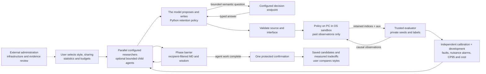

# Memory-policy research flow

```mermaid
flowchart LR
 U["User selects style, sharing<br/>statistics and budgets"] --> P["Parallel configured researchers<br/>optional bounded child agents"]
 A["External administration<br/>infrastructure and evidence review"] -.-> U
 P --> Q["The model proposes and writes<br/>Python retention policy"]
 Q -->|bounded semantic question| C["Configured decision endpoint"]
 C -->|typed answer| Q
 Q --> V["Validate source and interface"]
 V --> S["Policy on PC in OS sandbox<br/>past observations only"]
 T["Trusted evaluator<br/>private seeds and labels"] -->|causal observations| S
 S -->|retained indices + aux| T
 T --> R["Independent calibration + development<br/>faults, nuisance alarms, CP95 and cost"]
 R --> P
 P --> B["Phase barrier<br/>recipient-filtered MD and wisdom"]
 B --> P
 B -->|agent work complete| H["One protected confirmation"]
 H --> O["Saved candidates and measured tradeoffs<br/>user compares styles"]
```

The research feedback cycle improves a candidate policy. It never changes the user's lab
organization or communication settings automatically.
